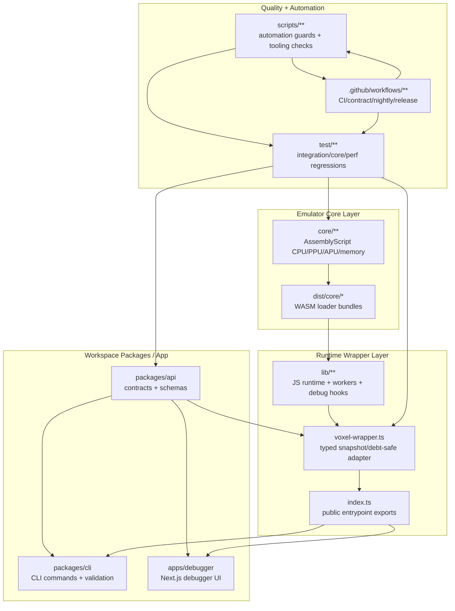

# Repository Architecture Map (2026-02-14)

This onboarding map summarizes how core runtime code, wrappers, workspaces, and
quality automation connect.

## Reading guide

- **Core** is the emulator truth source; wrapper/package layers consume it.
- **Runtime wrapper** (`lib/**`, `voxel-wrapper.ts`) translates WASM internals
  into stable APIs/contracts.
- **Workspace packages/app** consume shared contract surfaces from
  `packages/api`.
- **Quality layer** enforces cross-layer guarantees (tests + scripts + CI).

## First-stop files for new contributors

1. `README.md` (commands + workflow overview)
2. `voxel-wrapper.ts` (typed public runtime adapter)
3. `packages/api/src/index.ts` (contract registry + validators)
4. `packages/cli/src/index.ts` (CLI command routing)
5. `apps/debugger/app/page.tsx` (debugger entry UI)
6. `PLAN.md` + migration docs for current hardening priorities
